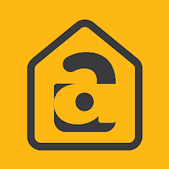

# Atomberg Remote Controller

<div align="center">
  
</div>

An Electron-based remote controller application for Atomberg smart fans using local UDP commands. This application allows you to control your Atomberg fans directly over your local network without relying on cloud APIs.

## Installation

### Option 1: Download Pre-built Application (Recommended)

Download the latest release for your platform from the [Releases page](https://github.com/ayushkumarbhadani/atomberg-remote-controller/releases):

- **macOS**: Download the `.dmg` file and drag to Applications folder
- **Windows**: Download the `.exe` installer and run it
- **Linux**: Download the `.AppImage` file and make it executable

### Option 2: Build from Source

1. Clone or download this repository
2. Install dependencies:
   ```bash
   npm install
   ```

## Features

- **Local Network Control**: Uses UDP communication to control fans locally
- **Device Discovery**: Automatically discovers Atomberg fans on your network
- **Full Remote Control** (UI displays only supported controls for your device): 
  - Power On/Off
  - Speed Control (1-6 levels)
  - Speed Increase/Decrease
  - Sleep Mode
  - Timer Settings (Off, 1h, 2h, 3h, 6h)
  - Light Control
  - Brightness Control (for supported models)
  - Color Temperature (for supported models)
- **Real-time Device Status**: Shows connected devices with IP addresses and series info
- **Responsive UI**: Works on different screen sizes

## Supported Models

The application supports all Atomberg smart fan models with varying feature sets:

| Model | Series | Power | Speed | Sleep | Timer | LED | Brightness | Color |
|-------|--------|-------|-------|-------|-------|-----|------------|-------|
| Renesa | R1 | ✓ | ✓ | ✓ | ✓ | ✓ | ✗ | ✗ |
| Renesa Halo | R1/R2 | ✓ | ✓ | ✓ | ✓ | ✓ | ✗ | ✗ |
| Renesa+ | R1 | ✓ | ✓ | ✓ | ✓ | ✓ | ✗ | ✗ |
| Studio+ | R1 | ✓ | ✓ | ✓ | ✓ | ✓ | ✗ | ✗ |
| Erica | K1 | ✓ | ✓ | ✓ | ✓ | ✓ | ✗ | ✗ |
| Aris Starlight | I1 | ✓ | ✓ | ✓ | ✓ | ✓ | ✓ | ✓ |
| Aris | I2 | ✓ | ✓ | ✓ | ✓ | ✓ | ✗ | ✗ |
| Aris Contour | M1 | ✓ | ✓ | ✓ | ✓ | ✓ | ✓ | ✗ |
| Renesa Elite | S1 | ✓ | ✓ | ✓ | ✓ | ✓ | ✓ | ✗ |
| Studio Nexus | S1 | ✓ | ✓ | ✓ | ✓ | ✓ | ✓ | ✗ |

## Requirements

- Node.js (v16 or higher) - Only needed if building from source
- npm or yarn - Only needed if building from source
- Atomberg smart fan connected to the same Wi-Fi network
- macOS, Windows, or Linux

## Usage

### If Downloaded as Application Package

Simply double-click the installed application or find it in your applications folder to launch.

### If Built from Source

1. **Start the application**:
   ```bash
   npm start
   ```

2. **Development mode** (with DevTools):
   ```bash
   npm run dev
   ```

### Using the Application

3. **Device Discovery**:
   - The application automatically listens for device beacon packets
   - Connected fans will appear in the device dropdown
   - Use the refresh button to manually refresh the device list

4. **Control Your Fan**:
   - Select your device from the dropdown
   - Use the control buttons to manage your fan
   - Features will be enabled/disabled based on your fan model

## Building

Build the application for distribution:

```bash
# Build for current platform
npm run build

# Build for specific platforms
npm run build-mac    # macOS
npm run build-win    # Windows
npm run build-linux  # Linux
```

## How It Works

### Device Discovery
- The application listens on UDP port 5625 for beacon packets from Atomberg fans
- Each fan sends a beacon packet every second containing its MAC address and series information
- The application maintains a list of active devices and removes inactive ones after a timeout

### Command Sending
- Commands are sent to devices via UDP on port 5600
- Commands are JSON-formatted and sent directly to the device's IP address
- The application uses the device MAC address to identify which device to control

### Available Commands

```javascript
// Power Control
{ "power": true }     // Turn on
{ "power": false }    // Turn off

// Speed Control
{ "speed": 1-6 }      // Set absolute speed
{ "speedDelta": ±1-5 } // Increase/decrease speed

// Sleep Mode
{ "sleep": true }     // Enable sleep mode  
{ "sleep": false }    // Disable sleep mode

// Timer
{ "timer": 0 }        // Turn off timer
{ "timer": 1 }        // 1 hour
{ "timer": 2 }        // 2 hours
{ "timer": 3 }        // 3 hours
{ "timer": 4 }        // 6 hours

// Light Control
{ "led": true }       // Turn on light
{ "led": false }      // Turn off light

// Brightness (supported models only)
{ "brightness": 10-100 }        // Set brightness percentage
{ "brightnessDelta": ±10-90 }   // Change brightness

// Color Temperature (I1 series only)
{ "light_mode": "warm" }      // Warm white
{ "light_mode": "cool" }      // Cool white  
{ "light_mode": "daylight" }  // Daylight
```

## Network Requirements

- Your computer and Atomberg fan must be on the same Wi-Fi network
- UDP ports 5625 (listening) and 5600 (sending) must not be blocked by firewall
- Multicast/broadcast traffic should be allowed on your network

## Troubleshooting

### No Devices Found
- Ensure your fan is connected to Wi-Fi and working with the official Atomberg app
- Check that your computer and fan are on the same network
- Try disabling firewall temporarily to test connectivity
- Use the refresh button to rescan for devices

### Commands Not Working
- Verify the device is selected in the dropdown
- Check the status messages for error details
- Ensure the fan is powered on and responsive
- Try restarting the application

### Performance Issues
- Close other applications that might be using network resources
- Check for network congestion
- Ensure stable Wi-Fi connection for both devices

## Technical Details

- Built with Electron for cross-platform compatibility
- Uses Node.js dgram module for UDP communication
- Implements automatic device discovery and cleanup
- Features responsive CSS design mimicking physical remote controls
- Includes error handling and status feedback

## Reporting Issues

Found a bug or have a feature request? We'd love to hear from you! Please follow these steps to raise an issue on GitHub:

### Before Creating an Issue

1. **Check existing issues**: Search through [existing issues](https://github.com/ayushkumarbhadani/atomberg-remote-controller/issues) to see if your problem has already been reported
2. **Try troubleshooting**: Review the [Troubleshooting](#troubleshooting) section above
3. **Test with latest version**: Ensure you're using the latest release

### Creating a New Issue

1. **Go to Issues**: Visit the [Issues page](https://github.com/ayushkumarbhadani/atomberg-remote-controller/issues)
2. **Click "New Issue"**: Start creating your report
3. **Choose the right template**:
   - 🐛 **Bug Report**: For unexpected behavior or errors
   - ✨ **Feature Request**: For new functionality suggestions
   - 📚 **Documentation**: For improvements to docs or README
   - ❓ **Question**: For general questions or support

### Bug Report Template

When reporting a bug, please include:

```
**Describe the bug**
A clear description of what the bug is.

**To Reproduce**
Steps to reproduce the behavior:
1. Go to '...'
2. Click on '....'
3. See error

**Expected behavior**
What you expected to happen.

**Screenshots**
If applicable, add screenshots to help explain your problem.

**Environment:**
- OS: [e.g., macOS 14.0, Windows 11, Ubuntu 22.04]
- App Version: [e.g., 1.0.0]
- Fan Model: [e.g., Renesa R1, Aris I1]
- Network: [e.g., Wi-Fi, router model if relevant]

**Additional context**
Add any other context about the problem here.
```

### Feature Request Template

When suggesting a feature:

```
**Is your feature request related to a problem?**
A clear description of what the problem is.

**Describe the solution you'd like**
A clear description of what you want to happen.

**Describe alternatives you've considered**
Other solutions or features you've considered.

**Additional context**
Add any other context, mockups, or examples about the feature request.
```

### Getting Help

- 📖 **Documentation**: Check this README for detailed usage instructions
- 🔍 **Search Issues**: Use GitHub's search to find similar problems
- 💬 **Discussions**: For general questions, use [GitHub Discussions](https://github.com/ayushkumarbhadani/atomberg-remote-controller/discussions)

## License

MIT License - feel free to modify and distribute as needed.

## Contributing

Contributions are welcome! Please feel free to submit issues and pull requests.

## Disclaimer

This application uses local network communication as documented in the official Atomberg developer documentation. Use at your own risk and ensure compliance with your network policies.